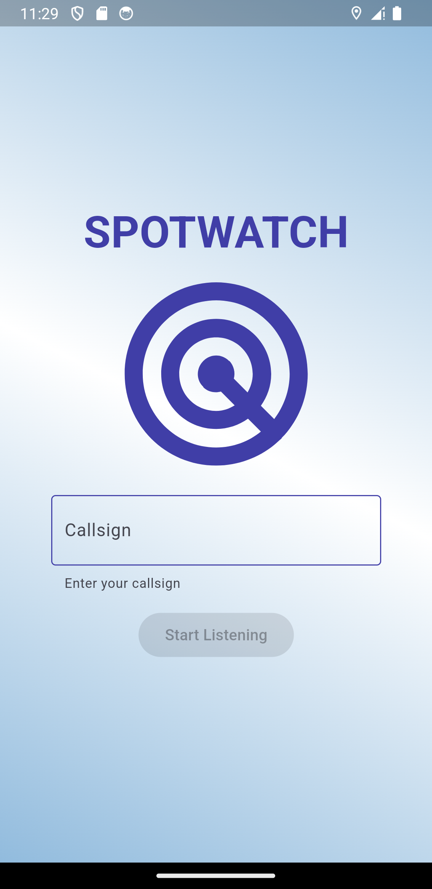
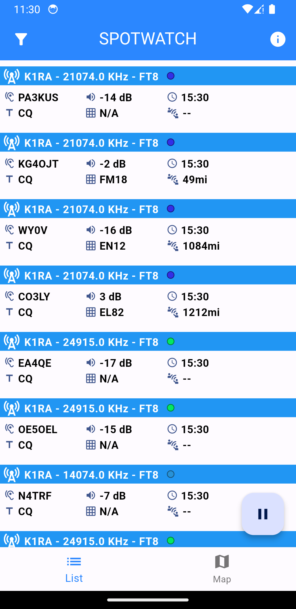
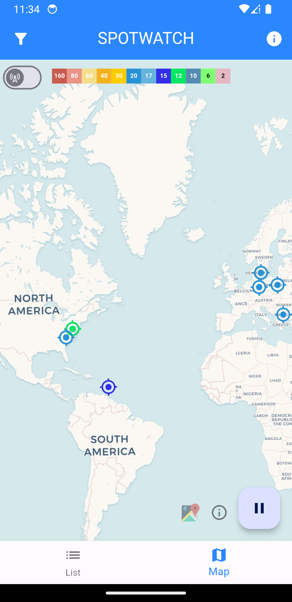

A minimal, mobile, <a href="https://www.reversebeacon.net/">Reverse Beacon</a> client. Spotwatch transforms the digital and CW Reverse Beacon telnet server streams into a user-friendly app. Spots are on a rolling buffer and can be viewed in a detailed list or plotted on a map (long-press or hover over the spot on the map for details). This was primarily envisioned as a tool for mobile operators to check realtime propagation conditions and ensure operators' signals are getting out, but will work on desktop too.

Planned features:
- [x] Android phone & tablet support
- [x] IOS, MacOS support
- [x] Windows 11 support
- [x] FT8/FT4, RTTY, CW spots
- [x] Callsign, Mode, Band filters
- [x] Show spots and beacons on map
- [ ] Offical Play store and App store distributions

Possible additional features:
- [ ] Nearby beacons filter, custom filters
- [ ] small logger screen that outputs basic .adif
  

